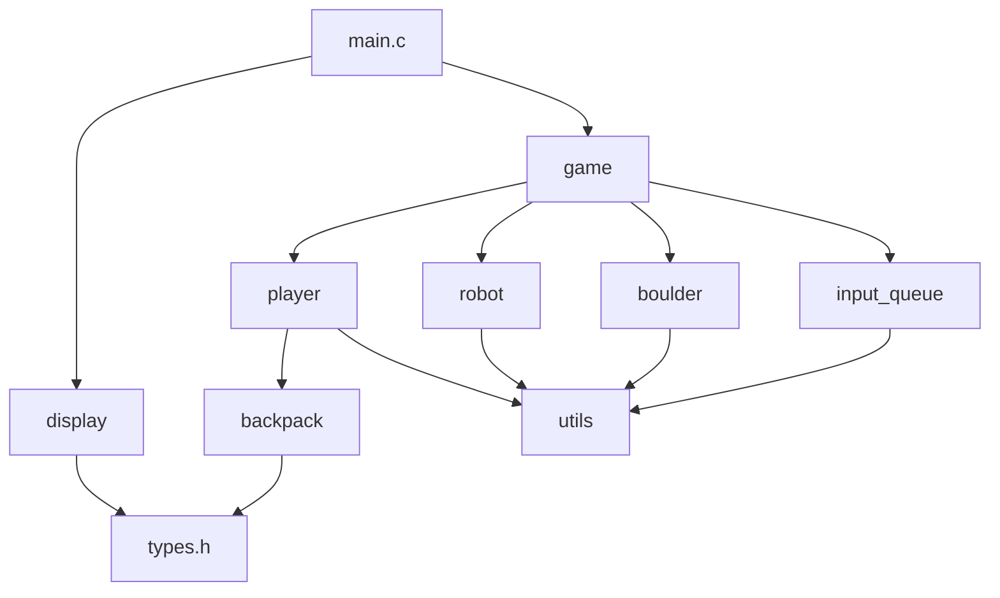

# Gravity Game — Project Skeleton Walkthrough

## Project Structure (14 files)

```
Gravity Game/
├── main.c              # Entry point, game loop, timing
├── types.h             # All constants, enums, structs
├── game.h / game.c     # Game initialization & state management
├── player.h / player.c # Player movement, input, treasure collection
├── robot.h / robot.c   # Robot random movement AI
├── boulder.h / boulder.c # Boulder gravity physics
├── backpack.h / backpack.c # LIFO stack with merging
├── input_queue.h / input_queue.c # Element queue & insertion
├── display.h / display.c # Console rendering
└── utils.h / utils.c   # Random helpers, timing, keyboard
```

---

## Module Dependency Map



---

## Recommended Implementation Order

Following the **Suggested Weekly Program** from the project specification:

### Week 1: Foundation
- [ ] Define all enums and structs in [types.h](file:///c:/Users/Alper/Desktop/Gravity%20Game/types.h)
- [ ] Implement utility functions in [utils.c](file:///c:/Users/Alper/Desktop/Gravity%20Game/utils.c)
- [ ] Implement [display.c](file:///c:/Users/Alper/Desktop/Gravity%20Game/display.c) (render the field)
- [ ] Implement [game.c](file:///c:/Users/Alper/Desktop/Gravity%20Game/game.c) `game_init()` (field generation)
- [ ] Wire up [main.c](file:///c:/Users/Alper/Desktop/Gravity%20Game/main.c) to init + render (you should see the maze!)

### Week 2: Player & Backpack
- [ ] Implement [player.c](file:///c:/Users/Alper/Desktop/Gravity%20Game/player.c) (movement, digging earth, pushing boulders)
- [ ] Implement [backpack.c](file:///c:/Users/Alper/Desktop/Gravity%20Game/backpack.c) (push, pop, merge logic)
- [ ] Add treasure collection + merging + scoring
- [ ] Add teleportation (Space key)
- [ ] Add frame timing to game loop

### Week 3: Input Queue
- [ ] Implement [input_queue.c](file:///c:/Users/Alper/Desktop/Gravity%20Game/input_queue.c) (generation probabilities, insertion, conversion rules)
- [ ] Hook up the 3-second timer in `game_update()`
- [ ] Display the input queue in the sidebar

### Week 4: Robots & Boulders
- [ ] Implement [robot.c](file:///c:/Users/Alper/Desktop/Gravity%20Game/robot.c) (random movement in 4 directions)
- [ ] Implement [boulder.c](file:///c:/Users/Alper/Desktop/Gravity%20Game/boulder.c) (direct fall, side fall, player kill, robot kill)
- [ ] Add game over detection

### Week 5: Polish & Debug
- [ ] Game over screen
- [ ] Console colors (optional but nice)
- [ ] Edge case testing (backpack full, chain merges, boulder chains)
- [ ] Performance tuning (flicker-free rendering)

---

## Key Game Rules to Remember

| Rule | Detail |
|------|--------|
| **Field** | 25 rows × 55 columns, walls on all borders |
| **Boulders** | Fall straight down, or slide sideways if stacked on another boulder |
| **Backpack** | LIFO, capacity 8. If full, top item is discarded before adding new |
| **Merging** | Two identical treasures on top: 1+1=10pts, 2+2=40pts, 3+3=90pts+teleport |
| **Input Queue** | 15 elements, inserts every 3 seconds, boulder insertion keeps count constant |
| **Robots** | Move randomly into empty squares only. Cannot collect or push anything |
| **Game Over** | Boulder falls on player OR robot reaches player's cell |
| **Scoring** | Merging treasures + destroying robots with boulders (900pts) |

---

## Compilation (Windows with GCC)

```bash
gcc -o gravity main.c game.c player.c robot.c boulder.c backpack.c input_queue.c display.c utils.c -Wall
```

Every `.c` file has detailed `TODO` comments with pseudocode to guide your implementation. Start with `types.h` and `utils.c`, then work your way up!
